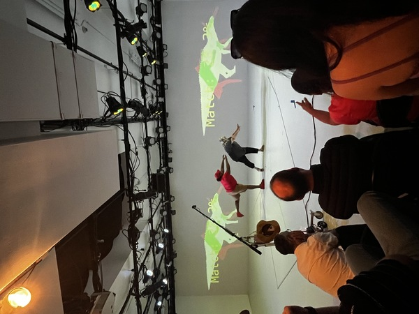

# AI-Directed Performance System

<p align="center">
  
  
  
</p>

## Overview

The AI-Directed Performance System is an interactive, real-time performance tool designed to recreate scenes from _Jurassic Park_ using pose tracking, audience-generated sound effects, and an automated camera and editing system. The system guides actors through shots using a main teleprompter and individual character teleprompters, and compiles the recorded audiovisual assets into a final video.

The project aims to work on both macOS and Linux.

## Core Functionalities

*   **Scene Recreation**: Guides actors through predefined scenes and shots.
*   **Automated Camera Work**: Directs PTZ (Pan-Tilt-Zoom) cameras based on shot definitions.
*   **Teleprompter System**:
    *   **Main Teleprompter**: Displays scene initialization, actor calls (name, character, headshot, props), and QR codes for character-specific teleprompters. Can also stream the live main recorder canvas.
    *   **Character Teleprompters**: Mobile-friendly views showing dialogue and blocking cues for individual actors.
*   **Real-time Pose Tracking**: Uses TensorFlow.js (MoveNet model) directly in the browser on live camera preview streams for visual feedback (e.g., skeleton overlays).
*   **Audio Recording**: Captures actor dialogue and audience sound effects through selectable input devices with gain and channel control.
*   **Concurrent Video Recording**: Records video from multiple cameras simultaneously using Node.js Worker Threads.
*   **Session Management**: Allows users to create and manage named recording sessions. The system organizes recorded files into session-specific directories.
*   **Final Scene Compilation**: Assembles the best takes into a final video.

## Dependencies and Installation

### General Dependencies

1.  **Node.js**: Ensure Node.js is installed. The version should support the features used in the project (refer to `package.json` for specific dependencies).
2.  **Project Dependencies**: Clone the repository and install Node.js dependencies:
    ```bash
    git clone <repository_url>
    cd <project_directory>
    npm install
    ```

### Linux Specific Dependencies

*   **Text-to-Speech (Optional)**:
    ```bash
    sudo apt install espeak     # If using espeak (likely optional as piper-tts is preferred)
    pip install piper-tts       # For piper-tts
    ```
*   **Camera Utilities**:
    ```bash
    sudo apt install v4l-utils  # For camera controls (e.g., OSBOT PITZ)
    sudo apt install v4l2loopback-dkms v4l2loopback-utils   # For creating virtual cameras
    ```
*   **CUDA (For NVIDIA GPUs)**:
    If you have an NVIDIA GPU and want to leverage it for TensorFlow.js or other tasks, install CUDA. Follow the official NVIDIA guide:
    [https://docs.nvidia.com/cuda/cuda-installation-guide-linux/#network-repo-installation-for-ubuntu](https://docs.nvidia.com/cuda/cuda-installation-guide-linux/#network-repo-installation-for-ubuntu)
*   **Audio Processing**:
    The system uses `sox` for audio recording and processing. Ensure it's installed:
    ```bash
    sudo apt install sox
    ```


### macOS Specific Dependencies

*   **Camera Utilities**:
    Install `uvc-util` for UVC camera controls: [https://github.com/jtfrey/uvc-util](https://github.com/jtfrey/uvc-util)
    ```bash
    # Follow installation instructions from the uvc-util repository
    ```
*   **Audio Processing**:
    The system uses `sox` for audio recording and processing. Ensure it's installed (e.g., via Homebrew):
    ```bash
    brew install sox
    ```

## Running the Application

Start the application using:

```bash
npm start
```
or
```bash
node app.js
```

This will typically start a web server accessible at `http://localhost:<port>` (the port can be found in the application's configuration or console output).

## Setup and Usage

### 1. Camera Setup

#### Linux Virtual Cameras (Optional)

If using physical cameras directly, this step might not be needed. For creating virtual cameras (e.g., to split a single camera feed or use OBS Studio output):

1.  **Remove existing v4l2loopback module (if loaded):**
    ```bash
    sudo modprobe -r v4l2loopback
    ```
2.  **Create virtual camera devices:**
    ```bash
    sudo modprobe v4l2loopback devices=2 video_nr=10,11 card_label="Logitech Preview","Logitech Record" exclusive_caps=0
    ```
    *   `devices=2`: Creates two virtual cameras.
    *   `video_nr=10,11`: Assigns specific device numbers (e.g., `/dev/video10`, `/dev/video11`). Ensure these are not already in use.
    *   `card_label`: Sets custom names for the virtual cameras.
3.  **Verify creation:**
    ```bash
    v4l2-ctl --list-devices
    ```

#### Physical Camera Identification & Control (Linux - e.g., OBSBOT)

1.  **Identify the OBSBOT camera device:**
    ```bash
    for i in /dev/video*; do
      echo -n "$i: ";
      v4l2-ctl --device="$i" --info 2>/dev/null | grep -i obsbot
    done
    ```
    The OBSBOT typically exposes multiple video interfaces. One lists controls, while the other provides the video feed and actual control access.
2.  **List controls for the identified device:**
    ```bash
    v4l2-ctl --device=/dev/videoX --list-ctrls  # Replace X with the correct device number
    ```
3.  **Test PTZ control:**
    ```bash
    v4l2-ctl --device=/dev/videoX --set-ctrl=pan_absolute=0
    ```

#### Camera Control (macOS - e.g., OBSBOT)

1.  Ensure `uvc-util` is installed.
2.  **List devices:**
    ```bash
    ./uvc-util --list-devices
    ```
3.  **Test PTZ control (example for device with interface 0):**
    ```bash
    ./uvc-util -I 0 -s pan-tilt-abs="{-3600, 36000}" # Set pan and tilt
    ./uvc-util -I 0 -s zoom-abs=50                 # Set zoom
    ./uvc-util -I 0 -c                             # Show controls for the device
    ```

### 2. Starting a Session

*   Open the application in your web browser.
*   On the home page, you can create a new recording session by providing a name. The system generates a session ID (e.g., `YYYY-MM-DD_HH-MM_YourSessionName`) and creates a corresponding directory in `recordings/`.
*   The application automatically selects the most recent session on startup. You can switch between existing sessions using the UI.

### 3. Actor "Drafting" and Character Assignment

*   The system uses a `database/scenes.json` file which defines scenes, shots, characters, and their associated props.
*   **Actor Assignment**:
    *   The AI Director (or a human operator through the UI) calls actors to the stage.
    *   The main teleprompter displays the actor's name, assigned character, their headshot (if available from `/database/actors/`), and any props (images from `/database/props/`).
    *   A QR code is displayed on the main teleprompter, linking to the character-specific teleprompter URL (e.g., `http://<host>:<port>/teleprompter/<characterName>`). Actors scan this to view their lines and blocking.
    *   Fixed character assignments can be managed via API endpoints (see `plan.md` for details).

### 4. Selecting a Scene and Starting

*   **Scene and Shot Definitions**: Scenes, their shots, camera angles, dialogue, and PTZ timings are defined in `database/scenes.json`.
*   **Initiating a Scene**:
    1.  The main teleprompter will first display "Initializing scene...".
    2.  Actors are then called as described above.
    3.  Once actors are ready, the performance for a shot can begin.
    4.  The system will trigger camera recordings and PTZ movements according to the `scenes.json` definition for the current shot.
    5.  Dialogue and blocking cues are displayed on the respective character teleprompters.

### 5. Recording Process

*   **Video**: For each shot, video is recorded from all specified cameras concurrently. Raw video files are saved to camera-specific subdirectories within the current session's recording directory (e.g., `recordings/<session_id>/<camera_name>/original.mp4`).
*   **Audio**:
    *   Actor dialogue and audience sound effects are recorded.
    *   The UI allows selection of audio input devices, gain adjustment (-24dB to +12dB using `sox vol`), and channel selection (Mono Ch1, Mono Ch2, Stereo Ch1+2 using `sox remix`).
    *   Recorded audio (likely `.wav` files) is stored in the session directory.
*   **Live Pose Tracking**: Performed client-side in the browser on camera preview streams for UI feedback (skeleton overlays). This is *not* part of the primary recorded video files by default.

### 6. Post-Performance

*   **Soundtrack Recording**: The system can orchestrate the recording of a musical soundtrack by the audience.
*   **Scene Compilation**: After all shots are recorded, the system can compile the best takes into a final video.

## Key Configuration Files and Directories

*   `app.js`: Main application entry point.
*   `config.json`: General application configuration settings.
*   `database/scenes.json`: Crucial file defining scenes, shots, characters, dialogue, props, and camera PTZ sequences.
*   `database/actors/`: Directory for actor headshots and potentially other data.
*   `database/props/`: Directory for prop images.
*   `recordings/`: Base directory where all session data (video, audio) is stored.
    *   `recordings/<session_id>/`: Directory for a specific recording session.
*   `public/`: Static assets (JavaScript, CSS, images) for the frontend UI.
*   `views/`: Server-side templates (EJS).
*   `workers/recordingWorker.js`: Handles video capture for individual cameras.
*   `services/audioRecorder.js`: Manages audio recording using `sox`.

## GStreamer Examples (For Reference/Testing)

These commands are useful for testing camera feeds and virtual camera setups on Linux.

### OBSCAM to 2 Virtual Outputs

This example takes a high-resolution camera feed (e.g., from `/dev/video4`) and tees it to two virtual camera sinks (`/dev/video10`, `/dev/video11`).

```bash
gst-launch-1.0 -v \\
  v4l2src device=/dev/video4 ! \\
    image/jpeg,width=3840,height=2160,framerate=30/1 ! \\
    jpegdec ! videoconvert ! \\
  tee name=t \\
    t. ! queue max-size-buffers=1 leaky=downstream ! videoconvert ! videoscale ! video/x-raw,width=3840,height=2160 ! v4l2sink device=/dev/video10 sync=false \\
    t. ! queue max-size-buffers=1 leaky=downstream ! videoconvert ! videoscale ! video/x-raw,width=3840,height=2160 ! v4l2sink device=/dev/video11 sync=false
```

### Record from a Virtual Output

```bash
gst-launch-1.0 -e \\
  v4l2src device=/dev/video11 ! \\
    video/x-raw,framerate=30/1 ! \\
    x264enc tune=zerolatency bitrate=8000 speed-preset=ultrafast ! \\
    mp4mux ! \\
    filesink location=output.mp4
```

### Webcam Test to 2 Virtual Outputs

Similar to the OBSCAM example, but for a standard webcam.

```bash
gst-launch-1.0 -v \\
  v4l2src device=/dev/video2 ! \\
    image/jpeg,width=1920,height=1080,framerate=30/1 ! \\
    jpegdec ! videoconvert ! \\
    tee name=t \\
      t. ! queue max-size-buffers=1 leaky=downstream ! videoconvert ! videoscale ! video/x-raw,width=1920,height=1080 ! v4l2sink device=/dev/video10 sync=false \\
      t. ! queue max-size-buffers=1 leaky=downstream ! videoconvert ! videoscale ! video/x-raw,width=1920,height=1080 ! v4l2sink device=/dev/video11 sync=false
```

### Colorbars Test to 2 Virtual Outputs

Useful for basic virtual camera output testing.

```bash
gst-launch-1.0 videotestsrc ! tee name=t ! queue ! v4l2sink device=/dev/video10 t. ! queue ! v4l2sink device=/dev/video11
```

## Additional Notes

*   **Skeletor**: A separate module (`/skeletor`) is mentioned for potentially creating videos with subjects isolated on a transparent background using skeletal data. Its direct integration with the live recording workflow needs to be managed as per project requirements.
*   **Intake App**: The `plan.md` mentions a separate "Intake App" for participant registration (photo, name, acting exercise). This is noted as being in a separate repository.
*   **AI Voice**: While the system was designed with AI-generated voice cues in mind, current iterations may use a human comedian for live direction. Some code related to AI voice (`services/aiVoice.js`) might still be present.
*   **Secret Control Panel**: A hidden control panel accessible via a "S3CR37 P4N31" button or by pressing "H" provides debugging options (e.g., toggling header visibility).
*   **Video Shrinking**:
    ```bash
    ffmpeg -i directions.mp4 -an -vf "fps=30,scale=640:-2" -c:v h264_videotoolbox -b:v 2000k directions_small.mp4
    ```
    This command can be used to shrink `directions.mp4` files, possibly for use in character teleprompters or previews.

## Database Structure (Conceptual)

The project uses a JSON file (`database/scenes.json`) and a directory structure to manage data. A conceptual representation:

```
/database/
  scenes.json       # Master file for scenes, shots, dialogue, PTZ, props

  /actors/
    <actor_name>.jpg  # Headshots

  /props/
    <prop_name>.png   # Prop images

  /scenes/            # Potentially for scene-specific assets or compiled outputs
    /001 - scene name/
      movie.mp4       # Reference movie for the scene
      thumbnail.jpg
      /A - shot description/
        shot.mp4      # Reference for the shot
        thumbnail.jpg
      /B - .../
      ...

/recordings/
  /<session_id>/
    /<camera_name>/
      original.mp4  # Raw recorded video from this camera
    <dialogue_audio_file>.wav
    <sfx_audio_file>.wav
    ...
```

## `shots.json` Notation (Likely referring to `scenes.json` content)

Directions and dialogue within `scenes.json` follow a specific notation:

*   `_this is an action_` (e.g., `_you look at Dr. Grant_`)
*   `_this is a line of dialogue_` (e.g., `_It's... it's a dinosaur_`)

This notation helps the system parse and display instructions correctly on the teleprompters.
